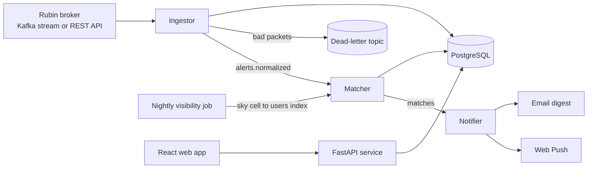

# hesper

**The Rubin Observatory alert stream, filtered for your backyard.**

hesper watches the real-time alert stream from the Vera C. Rubin Observatory, which can report millions of changes in the sky each night, and tells you about the handful you can actually see tonight: above your horizon, during darkness, and bright enough for your telescope.

> 🚧 **Status: in active development.** Sections marked *(planned)* describe features that are not built yet. See the [Roadmap](#roadmap) for current progress.

---

## Table of Contents

- [Why this exists](#why-this-exists)
- [Features](#features)
- [How it works](#how-it-works)
- [Tech stack](#tech-stack)
- [Getting started](#getting-started)
- [Filter language](#filter-language)
- [Design decisions](#design-decisions)
- [Performance targets](#performance-targets)
- [Testing strategy](#testing-strategy)
- [Repository layout](#repository-layout)
- [Roadmap](#roadmap)
- [Known challenges and open questions](#known-challenges-and-open-questions)
- [Learning resources](#learning-resources)
- [Contributing](#contributing)
- [Acknowledgments](#acknowledgments)

---

## Why this exists

In 2026, Rubin began its 10-year Legacy Survey of Space and Time (LSST). Every time it photographs a patch of sky, it compares the image to earlier ones and sends out an alert for anything that changed in brightness or position: supernovae, outbursting stars, asteroids, and more. At full survey rate, that can reach millions of alerts per night, each published within minutes.

These alerts are public, and they reach people through community **brokers**: systems that sort and classify them. The brokers are built for professional astronomers, who query for faint objects across the whole survey. An amateur with an 8-inch telescope in their backyard has a different question:

> *"What changed in the sky that I can go look at tonight?"*

Answering that question means filtering millions of alerts down to a few, based on each person's location, the night's darkness, and their equipment. hesper does that filtering, and it is built to keep up with the stream as it happens.

## Features

| Feature | Description | Status |
|---|---|---|
| **Tonight's Sky** | A personal list of the current night's visible, observable alerts, with image cutouts | *(planned)* |
| **Observer profiles** | Location, horizon limits, telescope limiting magnitude, and object interests | *(planned)* |
| **Custom filters** | A small query language for precise rules (see [Filter language](#filter-language)) | *(planned)* |
| **Push notifications** | Real-time alerts through the browser's Web Push, with quiet hours and nightly digests | *(planned)* |
| **Night planner** | Each user's observable targets for the night, ordered by when each one is highest in the sky | *(planned)* |
| **"Worth it" ranking** | A lightweight model that learns which alerts a user actually wants | *(planned)* |

## How it works



The system is split into small services that talk to each other through topics in a message queue. Each one can be scaled, restarted, or replayed independently.

**1. Ingestor.** Reads alert packets from a broker, decodes them from Avro (the compact binary format Rubin alerts use), validates them against the alert schema, and normalizes them. For example, it converts flux to magnitude (`mag = -2.5 * log10(flux_nJy) + 31.4`). Valid alerts are published to `alerts.normalized`. Packets that fail validation go to a dead-letter topic for later inspection instead of crashing the service.

**2. Nightly visibility job.** Every afternoon, this job works out which parts of the sky each user can see during that night's astronomical darkness, above their minimum altitude. The sky is divided into equal-area cells using [HEALPix](https://healpix.jpl.nasa.gov/). The job builds an inverted index that maps each **sky cell to the users who can see it tonight**.

**3. Matcher.** For each alert, the matcher looks up its sky cell to get the short list of candidate users. It then checks only those users' magnitude limits and custom filters. This avoids comparing every alert against every user, which is what keeps the service fast as the number of users grows (see [Design decisions](#design-decisions)).

**4. Notifier.** Turns matches into notifications. It removes duplicates using an idempotency key of `(user_id, alert_id)`, applies per-user rate limits and quiet hours, and either sends immediately or batches alerts into a digest.

**5. API and web app.** A FastAPI service serves profiles, subscriptions, tonight's matches, and alert cutouts to a React frontend.

## Tech stack

| Layer | Choice | Why |
|---|---|---|
| Stream | Kafka (Redpanda locally) | Brokers distribute alerts over Kafka; Redpanda is Kafka-compatible and runs as a single Docker container |
| Services | Python 3.12 | Direct access to Astropy, astroplan, and HEALPix libraries |
| Hot path | Python first, then an optional C++ or Rust port | Measure first, then port only the part that the benchmarks show is slow |
| API | FastAPI + Pydantic | Typed request and response models, async support |
| Database | PostgreSQL | Users, subscriptions, alert metadata, and delivery records |
| Cache | Redis | Rate limits and short-term deduplication |
| Astronomy | Astropy, astroplan, astropy-healpix | Coordinates, rise and set times, altitude, Moon separation, sky cells |
| Frontend | React + TypeScript | Tonight's Sky, profile setup, filter editor |
| Notifications | Web Push (VAPID) with email fallback | Free, and works without a mobile app |
| Observability | Prometheus, Grafana, OpenTelemetry | Latency, throughput, and consumer lag dashboards |
| CI | GitHub Actions | Lint (ruff), type check (mypy), tests (pytest), build Docker images |
| Deployment | Docker Compose on AWS EC2 | Simple to start; move to managed services only if needed |

## Getting started

*(planned: these commands describe the intended developer workflow)*

**Prerequisites:** Docker, Python 3.12, Node 20, and `make`.

```bash
git clone https://github.com/Neural-keeper/hesper.git
cd hesper
cp .env.example .env          # add broker credentials and VAPID keys
make up                       # starts Redpanda, Postgres, Redis, services, web app
make seed                     # creates a demo user at a sample location
make replay NIGHT=fixtures/sample_night.avro.gz SPEED=10
```

Then open `http://localhost:5173`. The replay command plays back a recorded night of alerts at 10× speed, so you can develop and test without waiting for real night-time data.

Other useful commands:

```bash
make test         # unit and integration tests
make bench        # matcher and filter-language benchmarks
make load         # load test at 10x the expected peak alert rate
make dashboards   # opens Grafana at localhost:3000
```

## Filter language

Users who want more control than the profile settings can write rules in a small, purpose-built query language:

```
class in (supernova, nova) and mag < 15.5 and alt > 30 and moon_sep > 20
```

```
type = variable and delta_mag > 1.0 and constellation = "Orion"
```

**Grammar** (simplified):

```ebnf
expr       = or_expr ;
or_expr    = and_expr { "or" and_expr } ;
and_expr   = not_expr { "and" not_expr } ;
not_expr   = [ "not" ] comparison | "(" expr ")" ;
comparison = field op value | field "in" "(" value { "," value } ")" ;
op         = "=" | "!=" | "<" | "<=" | ">" | ">=" ;
```

**Implementation.** A tokenizer feeds a recursive-descent parser, which builds a syntax tree. The tree is type-checked against a field registry, which rejects unknown fields and type mismatches when the filter is saved rather than when an alert arrives. It is then compiled into a Python function once, so evaluating it per alert is a plain function call. Filters never run as `eval()` or raw SQL.

**Available fields** (initial set): `class`, `type`, `mag`, `delta_mag`, `band`, `alt`, `moon_sep`, `constellation`, `ra`, `dec`, `age_hours`.

## Design decisions

| Decision | Alternative | Reasoning |
|---|---|---|
| Nightly **sky cell → users** index | Check every alert against every user | Turns each alert into a lookup plus a small candidate check. Visibility changes slowly over a night, so computing it once per evening is enough. |
| At-least-once delivery + idempotent notifications | Exactly-once Kafka transactions | True exactly-once delivery across a queue and external push services is not achievable. At-least-once processing combined with a unique `(user_id, alert_id)` constraint gives the same result for users and is easier to reason about. |
| Compile filters once when saved | Interpret the syntax tree on every alert | Moves parsing and validation cost out of the hot path. |
| Dead-letter topic for bad packets | Crash, or silently drop | A malformed packet should never stop the stream, and it should always be possible to inspect. |
| Record-and-replay harness | Only test against the live stream | Makes bugs reproducible, allows load testing at any speed, and allows development during the day. |
| One broker first | Consume raw Rubin output | Brokers already handle the full-rate stream and add classifications; hesper adds value by filtering for observers, not by reproducing broker work. |
| Web Push before mobile apps | Native iOS and Android apps | One codebase and no app store review. |

## Performance targets

These are the numbers to measure, track in Grafana, and report once the system works. The targets are starting goals and should be revised against real data.

| Metric | Target | How it's measured |
|---|---|---|
| Alert-to-notification latency, p50 / p95 | < 2 s / < 5 s after hesper receives the alert | Timestamps at ingest and at push send |
| Sustained throughput | ≥ 10× the observed peak alert rate | `make load` against the replay harness |
| Matcher cost per alert | < 1 ms average | `make bench` |
| Filter reduction | Millions of alerts per night → fewer than 10 per user | Delivery records per user per night |
| Consumer lag during peak | Returns to near zero within 60 s of a burst | Prometheus lag metric |
| Duplicate notifications | 0 | Unique constraint violations logged |

## Testing strategy

- **Unit tests** cover flux-to-magnitude conversion, visibility calculations (checked against known rise and set times), and every rule in the filter language's grammar.
- **Property-based tests** (Hypothesis) generate random valid and invalid filters to confirm the parser never crashes and always returns either a compiled filter or a clear error message.
- **Replay integration tests** run a recorded night through the full pipeline and compare the output against a stored "golden" set of expected matches.
- **Failure tests** kill a service partway through a batch and confirm that, after restart, no alerts are lost and no notifications are duplicated.
- **Load tests** replay at increasing speeds until latency targets break, and record where the bottleneck was.

## Repository layout

```
hesper/
├── services/
│   ├── ingestor/        # Kafka consumer, Avro decoding, validation, normalization
│   ├── visibility/      # nightly sky-cell index builder
│   ├── matcher/         # candidate lookup, filter evaluation
│   ├── notifier/        # dedup, rate limiting, Web Push, digests
│   └── api/             # FastAPI app
├── hesper_core/         # shared code: schemas, filter language, astronomy helpers
│   └── dsl/             # tokenizer, parser, type checker, compiler
├── web/                 # React + TypeScript frontend
├── fixtures/            # recorded alert nights for replay tests
├── bench/               # benchmarks
├── load/                # load test scripts
├── infra/               # docker-compose, Grafana dashboards, Prometheus config
├── docs/                # architecture notes, decision records
└── Makefile
```

## Roadmap

Each phase ends with something that works and can be shown to people. **"Done when"** is the test for moving on.

### Phase 0: Foundation
- [ ] Repository, Docker Compose, Makefile, `.env.example`
- [ ] GitHub Actions running ruff, mypy, and pytest on every push
- [ ] Pre-commit hooks

**Done when:** a fresh clone runs `make up` and `make test` successfully on a clean machine.

### Phase 1: Tonight's Sky, minimum version
- [ ] Choose one broker and get API access; poll its REST API every few minutes
- [ ] Store normalized alerts in Postgres
- [ ] Profile setup page: location, minimum altitude, limiting magnitude
- [ ] Visibility calculation with astroplan
- [ ] Tonight's Sky page with image cutouts
- [ ] Deploy to EC2

**Done when:** you can open the deployed site at dusk and get a correct list of observable alerts for your location.

### Phase 2: Streaming
- [ ] Redpanda in Docker Compose; switch the ingestor to a Kafka consumer
- [ ] Avro decoding and schema validation
- [ ] Dead-letter topic
- [ ] Record tool that saves a night to a file, and a replay tool that plays it back at N× speed

**Done when:** replaying a recorded night gives the same database contents as polling did.

### Phase 3: Matcher and filter language
- [ ] Nightly HEALPix visibility index
- [ ] Filter language: tokenizer, parser, type checker, compiler
- [ ] Filter editor in the web app with clear error messages
- [ ] Benchmarks comparing indexed matching with a check-every-user baseline

**Done when:** the matcher meets its per-alert cost target with 10,000 simulated users.

### Phase 4: Notifications
- [ ] Web Push with VAPID keys
- [ ] Idempotency key and unique constraint
- [ ] Per-user rate limits, quiet hours, digest mode

**Done when:** failure tests show no lost alerts and no duplicate notifications.

### Phase 5: Reliability and performance
- [ ] Prometheus metrics and Grafana dashboards for latency, throughput, and lag
- [ ] Load test at 10× peak; write up the bottleneck and the fix
- [ ] Optional: port the hottest code path to C++ or Rust and report the speedup

**Done when:** every metric in [Performance targets](#performance-targets) has a measured value.

### Phase 6: "Worth it" ranking
- [ ] Thumbs up and down on each notification
- [ ] A simple ranking model (start with logistic regression or gradient-boosted trees on alert features)
- [ ] Offline evaluation against a baseline of "brightest first"

**Done when:** the model beats the baseline on held-out feedback.

### Phase 7: Real users
- [ ] Onboard the USF astronomy club and a local amateur astronomy society
- [ ] Collect feedback and fix the top issues
- [ ] Write a blog post describing the architecture and measured results

**Done when:** people other than you use it on at least 10 separate nights.

## Known challenges and open questions

These are problems to investigate early, before they turn into design mistakes.

- **Brightness range.** Rubin is designed for very faint objects, and its detectors saturate on bright ones, roughly around magnitude 16 in a single exposure (verify this against Rubin documentation). Most amateur telescopes see objects brighter than about magnitude 14–15 by eye, or 17–18 with a camera. So the overlap between "Rubin reports it" and "an amateur can see it" may be narrow. It may be necessary to add a second source of brighter transients, such as the Transient Name Server or the ZTF survey.
- **Difference flux vs. total brightness.** Alerts report the *change* in brightness relative to an earlier reference image, not always the object's total brightness. For a variable star, the change can be small while the star itself is bright. Check which schema fields give total brightness before building magnitude filters on them.
- **Sky coverage.** Rubin surveys the southern sky from Chile. Observers far north will see fewer matches. hesper should show users how much of the survey area they can see, so an empty list is explained.
- **Classification quality.** Early classifications are uncertain. The interface should show the broker's confidence and avoid promising that something is "definitely a supernova."
- **Broker terms.** Confirm each broker's usage terms, rate limits, and attribution requirements before building on it.

## Learning resources

- **Rubin alert format:** the [`lsst/alert_packet`](https://github.com/lsst/alert_packet) repository (Avro schemas and examples)
- **Astronomy calculations:** [Astropy](https://docs.astropy.org/) and [astroplan](https://astroplan.readthedocs.io/) documentation
- **Sky indexing:** [HEALPix](https://healpix.jpl.nasa.gov/) and [astropy-healpix](https://astropy-healpix.readthedocs.io/)
- **Streaming systems:** *Designing Data-Intensive Applications* by Martin Kleppmann, especially the chapters on stream processing and message delivery guarantees
- **Building the filter language:** *Crafting Interpreters* by Robert Nystrom (free online), Part II covers tokenizers and recursive-descent parsers
- **Kafka locally:** [Redpanda documentation](https://docs.redpanda.com/)

## Contributing

Issues and pull requests are welcome. Before opening a pull request:

1. Run `make test` and `make bench`, and note any benchmark changes in the description.
2. Add or update tests for any behavior you change.
3. For significant design changes, add a short decision record in `docs/decisions/` explaining the problem, the options considered, and the choice.

## Acknowledgments

hesper uses public alert data from the NSF–DOE Vera C. Rubin Observatory, distributed through its community alert brokers. It is built on the open-source work of the Astropy and HEALPix communities. hesper is an independent project and is not affiliated with Rubin Observatory or any broker.

## License

MIT
